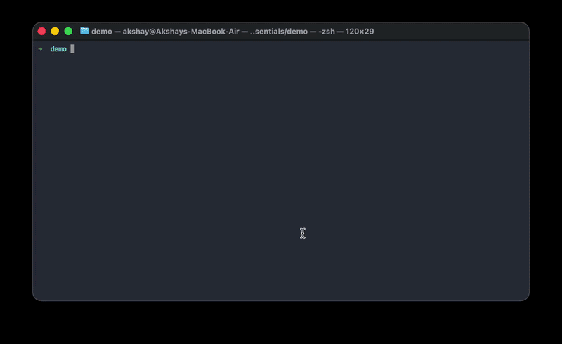

<h1 align="center">miii — Local AI Coding Agent for Your Terminal</h1>

<p align="center">
  <strong>An open-source, offline alternative to Claude Code, Cursor, and GitHub Copilot.</strong><br>
  A private AI pair-programmer in your terminal, powered by Ollama and any local LLM.<br>
  Private by default. Free forever. Works offline.
</p>

<p align="center">
  <a href="https://www.npmjs.com/package/miii-agent"></a>
  <a href="LICENSE"></a>
  <a href="https://nodejs.org"></a>
  <a href="https://ollama.com"></a>
</p>

<p align="center">
  
</p>

<p align="center">
  🔒 <strong>100% local</strong> — your code never leaves your machine &nbsp;·&nbsp;
  💸 <strong>Free</strong> — no API keys, no per-token billing &nbsp;·&nbsp;
  ⚡ <strong>Offline</strong> — runs on your own GPU
</p>

---

## What is miii? — a local AI coding agent

miii lives in your terminal and codes alongside you — reading files, writing features, running tests, fixing bugs. The twist: it runs on **your** hardware, powered by [Ollama](https://ollama.com) (or any local OpenAI-compatible server like [llama.cpp](https://github.com/ggml-org/llama.cpp) / [LM Studio](https://lmstudio.ai)).

Your code never leaves your disk. There's nothing to log in to. Pull a model, type `miii`, go. It's the open-source, offline answer to cloud coding assistants like Claude Code, Cursor, and GitHub Copilot.

## Install (macOS, Linux, Windows)

**macOS / Linux:**

```bash
ollama pull qwen2.5-coder:14b   # any coding model works
```

**Which model should I use?**
- **Low VRAM (8GB):** `qwen2.5-coder:7b` (Fast, capable)
- **Mid VRAM (16-24GB):** `qwen2.5-coder:14b` (Sweet spot)
- **High VRAM (48GB+):** `qwen2.5-coder:32b` (Powerhouse)

```bash
curl -fsSL https://raw.githubusercontent.com/maruakshay/miii-cli/main/install.sh | sh
miii
```
*(The installer downloads the pre-compiled binary and adds it to your local path)*

**Windows (PowerShell):**

```powershell
ollama pull qwen2.5-coder:14b
irm https://raw.githubusercontent.com/maruakshay/miii-cli/main/install.ps1 | iex
miii
```

Prefer npm? `npm install -g miii-agent` works on every platform.

> **Install failing on permissions?** Your global npm prefix isn't writable. The
> installer retries with `sudo` where available; otherwise point npm at a
> user-owned prefix and re-run:
> ```bash
> npm config set prefix "$HOME/.npm-global"
> export PATH="$HOME/.npm-global/bin:$PATH"   # add to ~/.bashrc or ~/.zshrc
> ```

Then just talk to it:

```
> refactor the auth module to use async/await
> @src/server.ts add rate limiting to all POST routes
> why are my tests failing in utils/parser.ts
```

> **Needs:** Node ≥ 18 and [Ollama](https://ollama.com/download) running locally.

## Staying up to date

miii checks npm on launch and, when a newer release exists, pulls it in the
background — it applies the next time you start. Manual options:

```bash
miii update     # update now
miii --version  # what you're running
```

Opt out of background updates by adding `"autoUpdate": false` to `~/.miii/config.json`,
or re-run the install script (`curl … | sh`) any time to update by hand.

## Why local-first? Private, free, offline

Most "AI coding tools" are just wrappers around a cloud API — slow, metered, and they ship your private codebase to someone else's server.

|              | Cloud agents          | **miii**                     |
|--------------|-----------------------|------------------------------|
| Your code    | Sent to a third party | Never leaves your machine    |
| Cost         | Per-token billing     | Free — runs on your hardware |
| Setup        | API keys, accounts    | `npm i -g miii-agent`        |
| Offline      | No                    | Yes                          |
| Latency      | Network + queue       | Your GPU only                |

It doesn't just chat, either — it follows a **Plan $\rightarrow$ Act $\rightarrow$ Observe** loop:
1. **Plan**: Decomposes the problem into a sequence of concrete steps.
2. **Act**: Calls the necessary tools to gather context or modify code.
3. **Observe**: Verifies the result and adjusts the plan until the goal is met.

## Five letters, five ideas

**s**mall · **s**imple · **s**mart · **s**trategic · **s**emantic — a tiny codebase you can read in an afternoon, no config ceremony, plans before it acts, and operates on the *meaning* of your code, not blind text matching.

## Features

- **🧪 `miii doctor`** — not every local model can drive an agent. Doctor runs your models through real engineering tasks and tells you which ones actually deliver.
  ```bash
  miii doctor                  # grade every installed model
  miii doctor qwen2.5-coder:7b # grade one
  ```
- **🖼️ Paste images** — copy a screenshot and hit `Ctrl+V` to attach it to your message, or paste an image file path. Great for "why does this UI look broken?" or reading an error screenshot. **Needs a vision-capable model** (`llava`, `llama3.2-vision`, `qwen2-vl`, …) — text-only models silently ignore the image.
  ```bash
  ollama pull llava            # or llama3.2-vision
  ```
- **💧 Lossless output spill** — that 50K-line test log won't get truncated and leave the model guessing. miii spills the full output to disk and lets the model page through it. Nothing is ever lost.
- **🔒 Permission-gated tools** — you approve what the agent can touch; "always" approvals persist. File tools are confined to your working directory.
- **📄 `MIII.md`** — drop one in your repo to teach miii your conventions, build/test commands, and do's & don'ts. Same idea as `CLAUDE.md`, read every turn.

## Going deeper

<details>
<summary><strong>Built-in tools</strong></summary>

| Tool | Function |
|------|----------|
| `read_file` | Read any file in your workspace |
| `write_file` | Create new files |
| `edit_file` | Precise string-level edits, whitespace-tolerant |
| `glob` | Pattern-match files across the project |
| `grep` | Regex search across files |
| `run_bash` | Execute shell commands |

File tools (`read_file`, `write_file`, `edit_file`) reject `../` traversal and absolute paths outside the workspace. `run_bash` is **not** path-confined — its only boundary is the permission prompt, so review commands before approving (especially "always"). Saved rules live in `~/.miii/permissions.json`.
</details>

<details>
<summary><strong>Keyboard shortcuts</strong></summary>

| Key | Action |
|-----|--------|
| `Enter` | Send prompt |
| `@filename` | Attach file to context |
| `Ctrl+V` | Paste clipboard image (needs a vision model) |
| `/models` | Switch active model |
| `/clear` | Reset conversation |
| `Esc` | Stop generation or tool run |
| `Ctrl+O` | Toggle full tool output |
| `Ctrl+C` | Quit |
</details>

<details>
<summary><strong>Configuration & other backends</strong></summary>

Settings live in `~/.miii/config.json`, created on first run:

```json
{
  "model": "qwen2.5-coder:14b",
  "ollamaHost": "http://localhost:11434",
  "effort": "medium"
}
```

`effort` (`low` \| `medium` \| `high`) controls temperature and limits.

miii talks to any **OpenAI-compatible** local server too. Start `llama-server`, then point a named provider at it:

```json
{
  "model": "qwen2.5-coder-14b",
  "provider": "llamacpp",
  "providers": {
    "llamacpp": { "type": "openai", "baseUrl": "http://localhost:8080" }
  }
}
```

Switch at launch with `miii --provider llamacpp`. Any `openai`-type provider on `localhost` counts as local — no key, no cloud.
</details>

<details>
<summary><strong>How it spills output</strong></summary>

When a tool result exceeds the inline budget (~10K bytes), the full output is written to `~/.miii/output/<id>.txt`. Only a head + tail preview is inlined, with a pointer:

```
[command output truncated: 5184 lines / 412900 bytes.
 Full output at ~/.miii/output/9f3a1c.txt — read it with
 read_file offset/limit to see the elided middle.]
```

The model pages through the middle with ranged `read_file` reads. Spill files are garbage-collected after 24 hours.
</details>

<details>
<summary><strong>Development</strong></summary>

**Project Architecture:**
```text
src/
 ├── agent/    # The core reasoning loop
 ├── tools/    # Implementation of read/write/bash
 ├── terminal/ # UI and input handling
 └── config/   # Settings and provider logic
```

```bash
git clone https://github.com/maruakshay/miii-cli.git
cd miii-cli
npm install
npm run dev
```

```bash
npm run build       # production build
npm run typecheck   # type-check src + eval
npm run eval        # regression gate (powers `miii doctor`)
```

To run your local working tree against the global `miii`:

```bash
npm run build && npm link   # restore later with: npm install -g miii-agent
```
</details>

---

## FAQ

**Does miii work without internet?**
Yes. Once you've pulled a model with Ollama, miii runs fully offline. No network calls, no account, no cloud.

**Is my code sent anywhere?**
No. Every file read, edit, and model inference happens on your machine. Your codebase never leaves your disk.

**Which model is best for coding?**
Depends on VRAM: `qwen2.5-coder:7b` (8GB), `qwen2.5-coder:14b` (16–24GB, the sweet spot), `qwen2.5-coder:32b` (48GB+). Run `miii doctor` to grade your installed models on real engineering tasks.

**How is miii different from Claude Code, Cursor, or GitHub Copilot?**
Claude Code, Cursor, and Copilot are cloud services — metered, account-gated, and they ship your code to a third-party server. miii is open-source, free, and runs entirely on your hardware. Same terminal-agent workflow as Claude Code, but on your own local model.

**How is it different from Continue.dev?**
Continue.dev is an IDE extension. miii is a standalone terminal agent — no editor required — with a Plan → Act → Observe loop, permission-gated tools, and lossless output spill built in.

**Do I need a GPU?**
No, but it helps. Smaller models run on CPU; a GPU makes larger models fast enough for real work.

## Status

**MVP.** Core agent loop is stable; actively refining tool execution, streaming, and the permission model. PRs welcome — fork it, break it, improve it.

## License

MIT © [maruakshay](https://github.com/maruakshay)

<p align="center">
  <em>Built for engineers who'd rather own their tools than rent them.</em>
</p>
