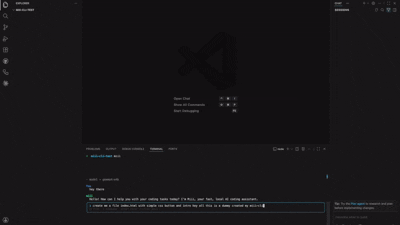

# Miii — Local-First AI Coding Agent

> **The only coding CLI that runs fully local or cloud — any model, zero lock-in, zero monthly bill.**



[](https://www.npmjs.com/package/miii-cli)
[](https://www.npmjs.com/package/miii-cli)
[](LICENSE)
[](https://nodejs.org)

---

**Miii is a fully autonomous coding agent that runs entirely on your machine.** It plans, edits files, runs your tests, searches the web, indexes your codebase semantically, and iterates until the job is done — all without a single byte of your code leaving your network.

Zero subscription. Zero cloud dependency. Zero Python overhead. **176 KB total.**

```bash
npm install -g miii-cli && miii
```

---

## Why Miii Exists

Claude Code is impressive. It's also cloud-only, costs $20–200/month, and sends every line of your codebase to a server you don't control.

OpenCode and Codex CLI have the same problem — they're all cloud-first, all locked to specific providers, and all charge you indefinitely for the privilege of reading your private code.

**Miii flips the model.** Run on Ollama: $0/month, fully offline, code never leaves your machine. Switch to Anthropic or OpenAI when you need cloud power. Change providers live inside the app — no config files, no restarts.

Your compute. Your data. Your rules.

---

## How Miii Compares

| | **Miii** | Claude Code | OpenCode | Codex CLI | Aider |
|---|:---:|:---:|:---:|:---:|:---:|
| Monthly cost | **$0** | $20–200 | API cost | API cost | $0 |
| Bundle size | **176 KB** | ~50 MB | ~30 MB | ~20 MB | ~200 MB |
| Local / offline (Ollama) | **✅** | ❌ | partial | ❌ | ⚠️ |
| Air-gapped | **✅** | ❌ | ❌ | ❌ | ❌ |
| Switch provider live | **✅** | ❌ | ❌ | ❌ | ❌ |
| File checkpoints (undo) | **✅** | ❌ | ❌ | ❌ | ❌ |
| Permission gates | **✅** | ✅ | partial | ✅ | ❌ |
| MCP client | **✅** | ✅ | ✅ | ❌ | ❌ |
| Semantic codebase index | **✅** | ❌ | ❌ | ❌ | ❌ |
| Skill/extension system | **✅** | plugins | ❌ | ❌ | ❌ |
| Startup time | **<100ms** | ~2s | ~1s | ~1s | ~4s |
| License | **MIT** | Proprietary | MIT | MIT | Apache 2.0 |

---

## What Miii Actually Does

This isn't autocomplete. Miii is a **full autonomous agent loop:**

1. You describe a goal
2. Miii reads your codebase, plans the changes, edits the files
3. It asks your permission before touching anything (edit, delete, run commands)
4. It runs your test suite automatically after every change
5. If tests fail, it reads the error, fixes the code, re-runs
6. It repeats until the work is done — and checkpoints every file so you can abort safely

---

## What a Session Looks Like

```
> refactor the auth module to use JWT instead of sessions

  ● Researching: refactor auth module to use JWT
  ● Reading src/auth/session.ts
  ● Reading src/middleware/auth.ts
  ● Reading src/routes/login.ts

  Planning: 3 file(s) to change

  ⚠ edit_file  src/auth/session.ts   y approve  n deny
  > y

  ● Editing src/auth/session.ts
  ● Editing src/middleware/auth.ts
  ● Editing src/routes/login.ts
  ● Running tests

  ─ refactor done — 3 file(s) processed
```

---

## Killer Features

**🔒 Privacy-First, Local by Default**
Run on Ollama and your code never leaves your machine. No account. No API key. No monthly bill. Switch to Anthropic or OpenAI when you need it — one command, live, mid-session.

**🔄 Live Provider Switching**
Type `/config` to open an interactive picker. Arrow-navigate between Ollama, Anthropic, and OpenAI-compatible endpoints. Change model, API key, base URL, or Tavily key without restarting. Config saves automatically.

**🛡 Permission Gates + File Checkpoints**
Miii asks before every edit, delete, or shell command — just like Claude Code. Every file is checkpointed before it's touched. Hit Esc to abort and all changes roll back automatically.

**🔍 Semantic Codebase Indexing**
Build a vector index of your entire codebase using local embeddings. Ask "where is the auth logic?" and Miii finds it by meaning, not keyword. No data leaves your machine.

**🧠 Deep Think Engine**
Before answering complex questions, Miii runs a constrained research phase — reading files, checking git history, searching the web — then synthesizes a grounded answer.

**🌐 Real-Time Web Access**
Tavily-powered web search, built in. Ask about breaking changes in a library you just upgraded. Get an answer that's actually current.

**🛠 Surgical File Editing**
`patch_file` replaces exact strings in your files. No full rewrites. No formatting destruction. Exactly the change, nothing more.

**🔁 Self-Healing Test Loop**
Runs `npm test` after every file change. If something breaks, reads the failure trace and fixes it autonomously — up to 3 retries before surfacing the issue.

**📂 Persistent Sessions**
Pick up exactly where you left off. Named sessions mean your context, history, and goal survive terminal restarts.

**📦 Skill System**
Extend Miii with plain Markdown files or npm packages. Ship reusable agent behaviors as versioned packages your whole team can pull.

**🔌 MCP Client**
Connect any MCP-compatible tool server. Miii discovers tools automatically and makes them available to the agent.

---

## Get Running in 60 Seconds

```bash
# 1. Start Ollama and pull a model
ollama pull qwen2.5-coder:7b

# 2. Install Miii
npm install -g miii-cli

# 3. Go to your project and start
cd your-project
miii
```

No API keys. No account. No sign-up form. First run walks you through setup interactively.

---

## Power Commands

| Command | What it does |
|---|---|
| `/config` | Open interactive picker — change provider, model, API key, base URL, Tavily key live |
| `/think <question>` | Deep research: reads files + web, then answers |
| `/refactor <goal>` | Autonomous multi-file refactor with test validation |
| `/index build` | Build semantic vector index of your codebase |
| `/index search <query>` | Find code by meaning, not string match |
| `/git review` | AI reviews your current diff for bugs and issues |
| `/git commit <msg>` | Stage everything and commit in one shot |
| `/plan <topic>` | Structured planning mode before you write a line |
| `/model <name>` | Hot-swap your LLM mid-conversation |
| `/session <name>` | Switch between named project sessions |
| `@filename` | Inject any file directly into context |

---

## Semantic Codebase Indexing

For large codebases, Miii builds and queries a local vector index — no third-party APIs, no embeddings sent anywhere.

```bash
# Pull an embedding model (one time)
ollama pull nomic-embed-text

# Index your project
/index build

# The agent calls search_codebase automatically when it needs to find code by concept
```

---

## Configuration

**Interactive (recommended):** type `/config` inside Miii to open the picker.

**File-based:** drop a `.miii.json` in your project root or `~/.config/miii/config.json` globally:

```json
{
  "model": "qwen2.5-coder:7b",
  "provider": "ollama",
  "baseUrl": "http://localhost:11434",
  "gitContext": true,
  "embedModel": "nomic-embed-text"
}
```

Providers: `ollama` (local, free) · `anthropic` (Claude API) · `openai-compat` (OpenAI or any compatible endpoint)

---

## Build from Source

```bash
git clone https://github.com/maruakshay/miii-cli
cd miii-cli && npm install && npm run build && npm link
```

---

## Who Should Use Miii

- **Privacy-conscious developers** — won't send proprietary code to Anthropic or OpenAI
- **Cost-sensitive teams** — API bills compound; Ollama is $0
- **Air-gapped environments** — regulated industries, defense, offline infra
- **Model experimenters** — want to try llama3, mistral, qwen, Claude side-by-side without switching tools

---

## The Bottom Line

The AI coding tools you're paying for right now will raise their prices, change their terms, and keep reading your code. **Miii won't.** It's MIT licensed, runs locally, and gets better every time Ollama ships a new model.

If this saves you time or money, **star the repo** — it's the only metric that tells other engineers this is worth their attention.

**[⭐ Star on GitHub](https://github.com/maruakshay/miii-cli)**

> Built by [@maruakshay](https://github.com/maruakshay) — open to PRs, issues, and model recommendations.

---

## License

MIT — do whatever you want with it.
