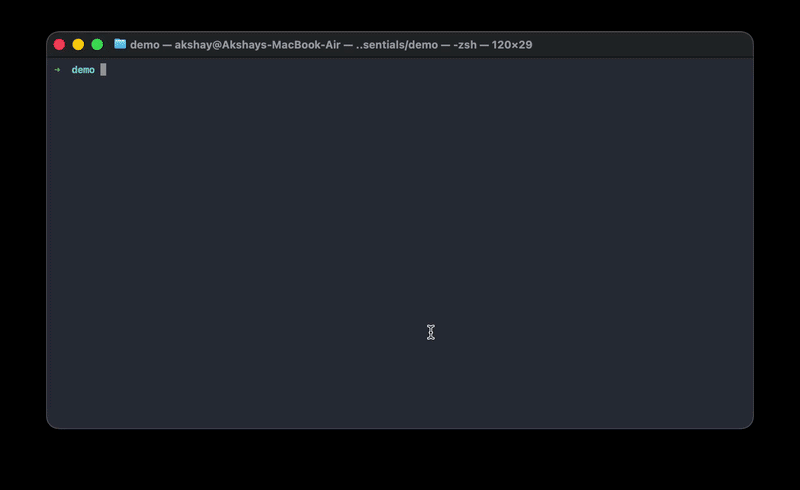

<h1 align="center">miii</h1>

<p align="center">
  <strong>🇮🇳 Made in India. Free forever. Works with any model.</strong><br>
  A Claude Code–style coding agent for your terminal — it reads your files, writes the code,<br>
  runs your tests, and fixes what breaks. Bring Claude, GPT, Gemini, DeepSeek, or a model on your own GPU.
</p>

<p align="center">
  <em>Apna code, apna model, apni marzi.</em>
</p>

<p align="center">
  <a href="https://www.npmjs.com/package/miii-agent"></a>
  <a href="LICENSE"></a>
  <a href="https://nodejs.org"></a>
  
  
  <a href="https://github.com/sponsors/maruakshay"></a>
</p>

<p align="center">
  
</p>

<p align="center">
  🆓 <strong>Free &amp; open source — no account, no subscription</strong> &nbsp;·&nbsp;
  🔌 <strong>Any provider, one tool</strong> &nbsp;·&nbsp;
  ⚡ <strong>Install to first edit in a minute</strong>
</p>

## Why it exists

Agentic coding tools like Claude Code changed how software gets written. But most of them
lock you into one vendor, one subscription, and a bill in dollars.

miii was built in India to give every developer that same workflow — plan, edit, run,
verify — on their own terms. Use the best hosted model when you need it, a free tier when
you're experimenting, or a local model when the code can't leave your laptop. Students,
freelancers, startups, and enterprise teams all get the same tool, and it costs nothing.

## Get started in 60 seconds

```bash
npm i -g miii-agent
```

Then pick how you want to run it:

```bash
# Hosted — uses the key you already export (ANTHROPIC_API_KEY, OPENAI_API_KEY, GEMINI_API_KEY, …)
miii provider add gemini
miii

# Local — free, offline, nothing to sign up for
ollama pull qwen3-coder:30b
miii
```

Switch any time with `/provider` inside miii.

Now talk to it like a teammate:

```
> refactor the auth module to use async/await
> @src/server.ts add rate limiting to all POST routes
> why are my tests failing in utils/parser.ts
```

It plans before it acts, and runs your test suite before it claims to be done.

<sub>Windows: `irm https://raw.githubusercontent.com/maruakshay/miii-cli/main/install.ps1 | iex` · Needs Node 18+ and a POSIX shell (git-bash or WSL on Windows; without one, file tools fall back to Node's own filesystem calls).</sub>

## Your model, your choice

One command wires up any backend: `/provider add <name>` inside miii, or
`miii provider add <name>` from your shell. The endpoint is built in; the key comes from
the environment variable you already export.

| Hosted (your key)                                                                                | Local (no key, fully offline)          |
|--------------------------------------------------------------------------------------------------|----------------------------------------|
| Anthropic · OpenAI · Gemini · Groq · OpenRouter · DeepSeek · Mistral · Together · Cerebras · xAI | Ollama · LM Studio · llama.cpp · vLLM  |

Anything else that speaks the OpenAI protocol works too: `/provider add <name> <baseUrl>`.

**Paying nothing is a real option.** miii is free, local models are free, and providers
like Gemini, Groq, OpenRouter, and Cerebras offer free tiers — enough to get real work done
without a credit card.

|            | Single-vendor agents   | **miii**                                  |
|------------|------------------------|-------------------------------------------|
| The tool   | Subscription           | Free, MIT-licensed                        |
| Models     | One vendor's           | 14+ providers, or your own GPU            |
| Setup      | Account + login        | `npm i -g miii-agent`                     |
| Your code  | Goes to that vendor    | Goes where you choose — or stays local    |
| Offline    | No                     | Yes, with a local model                   |

## Everything Claude Code users expect

- **⚖️ Decision Box** — A second, smaller model judges whether the work is *really* done before the agent stops. No more "I've updated the file!" when it hasn't.
- **📋 Plan Mode** — `/plan` makes the session read-only. It researches, then proposes. Nothing is written until you approve.
- **🔒 Permission-Gated** — You approve every write and every command. Saved rules persist in `.miii/permissions.json`.
- **⟲ /rewind** — Undo the agent's changes *and* the conversation, back to any previous turn. Checkpoints make bad turns cheap.
- **🧩 Subagents** — Delegated `task` loops burn their own context on a search, and hand back only the answer.
- **🧠 Model-Aware** — Small models emit broken tool calls. miii parses them anyway, and reshapes the prompt to fit each model's context window.
- **🔀 Switch Anytime** — `/provider` and `/models` swap backends without restarting. Try a free tier today, move to a local GPU tomorrow.
- **🔌 MCP Support** — Connect GitHub, Postgres, or internal services over Model Context Protocol.
- **🪝 Shell Hooks** — Fire your own commands on tool events — format on write, block a path, log everything.
- **🖥️ Headless** — `miii -p "prompt"` for scripts, CI, or piping a git diff straight in.
- **🐚 Shell-Backed Edits** — Reads and writes go through the shell, confined to your working directory, with a filesystem fallback when there's no shell.

<details>
<summary><strong>Every slash command</strong></summary>

`/plan` · `/models` · `/provider` · `/agents` · `/mcp` · `/permissions` · `/rewind` ·
`/sessions` · `/memory` · `/context` · `/compact` · `/cost` · `/review` · `/init` ·
`/export` · `/copy` · `/settings` · `/vim` · `/new` · `/clear`

</details>

## Going local? Pick a model for your GPU

Budget a few GB above the download size for the context window.

| VRAM    | Model                          | Size    |
|---------|--------------------------------|---------|
| < 4GB   | `qwen2.5-coder:3b`             | 1.9 GB  |
| 8GB     | `qwen2.5-coder:7b`             | 4.7 GB  |
| 12–16GB | `qwen2.5-coder:14b`            | 9.0 GB  |
| 16–24GB | `gpt-oss:20b` · `devstral:24b` | ~14 GB  |
| 24GB+   | `qwen3-coder:30b` ⭐            | 18.6 GB |

Tool-calling is what separates a usable agent model from a frustrating one. `qwen3-coder`
and `devstral` are trained for it; miii repairs the calls from everything else.

## FAQ

<details>
<summary><strong>Is miii really free?</strong></summary>

Yes. miii itself is MIT-licensed with no paid tier, no account and no sign-up. What you
pay for is the model: nothing if it runs on your machine, and whatever your provider
charges if you use a hosted one — several of which have free tiers.
</details>

<details>
<summary><strong>Is my code ever uploaded?</strong></summary>

With a local provider, your code only ever travels to `localhost`. No telemetry and
no analytics — the one outbound call miii makes on its own is a version check against
`registry.npmjs.org`, which carries nothing but the package name. Add a hosted provider
and that provider sees what you send it, which is why local is the default.
</details>

<details>
<summary><strong>Can it break my repo?</strong></summary>

Every write and every shell command asks first, and file tools are confined to the
working directory. When something does go wrong, `/rewind` puts the files and the
conversation back.
</details>

<details>
<summary><strong>Do I need a GPU?</strong></summary>

No. Use a hosted provider and any laptop will do. For fully local models you want one — `qwen2.5-coder:3b` runs on CPU, but it will be slow and it will need
more hand-holding. Apple Silicon works well — unified memory counts as VRAM here.
</details>

<details>
<summary><strong>Why not just use Claude Code / Cursor?</strong></summary>

Use them if you can. miii is for when you want the same workflow without being tied to
one vendor or one subscription: pick any model, pay only for what that model costs,
or go fully offline for air-gapped work, NDA'd code, or a flight with no wifi.
</details>

## Sponsor miii 💛

miii is built and maintained independently, from India, with no VC money and no paid tier.
Sponsorship is what keeps it that way — it pays for GPU and API time to evaluate new
models across providers, test hardware, and the hours that go into making every model,
big or small, behave like a real coding agent.

- **Individuals** — [GitHub Sponsors](https://github.com/sponsors/maruakshay), any amount, one-time or monthly.
- **Companies** — if your team uses miii for private or air-gapped work, sponsoring gets
  your logo here and a direct line for the features you need. Open an issue or reach out
  via [GitHub](https://github.com/maruakshay).
- **Free ways to help** — star the repo, share it with your dev community, file issues,
  and send PRs.

<!-- Sponsor logos go here -->

## Contributing

Issues and PRs are welcome from anyone, anywhere. Good places to start: model
compatibility reports (which models work well on which hardware), bug reports with a
repro, and docs improvements.

---

<p align="center">
  <strong>⭐ Star it if you think great coding tools should be free for everyone.</strong><br>
  <sub>Built with ❤️ in India 🇮🇳 · MIT © <a href="https://github.com/maruakshay">maruakshay</a></sub>
</p>
